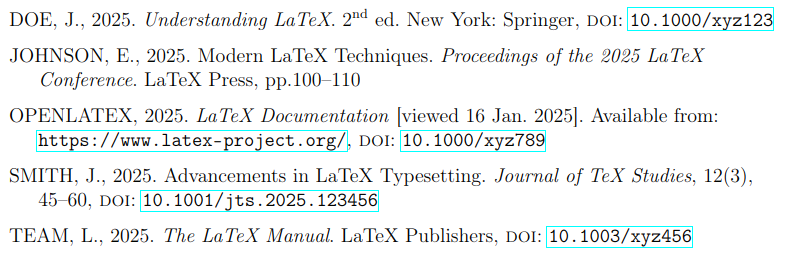

# SSU LaTeX Template

Microsoft Word is convenient, but if you've ever written a long document, you'll know it can struggle with formatting. LaTeX, on the other hand, consistently defines formatting as code.

This repository contains a pre-structured template for LaTeX reports formatted according to Solent University's guidelines. It also includes custom BibLaTeX drivers for the Solent-Harvard referencing style, ensuring that references from tools like RefWorks or [Zotero]([Zotero](https://www.zotero.org/)) are automatically formatted correctly.

## Documentation
Guidance and usage instructions can be found in the documentation, available [online](https://samcole8.github.io/solent-latex-template/) or in the `docs/` directory.

## Disclaimer
While every effort has been made to ensure this template produces documents in the required format, the user assumes responsibility in the event that it produces incorrectly formatted or corrupted content.

Therefore, it is strongly recommended that you:

- Test document generation early, as LaTeX installation can take time.
- Proofread and verify the generated content before submission.

## Software License
This template is licensed under the [CC BY-NC-SA 4.0](https://creativecommons.org/licenses/by-nc-sa/4.0/deed.en) license. This license establishes different rules for **software** and **content**, which are explained below:

- You *cannot* use the template code itself (**software**) for commercial purposes.
- You *can* use the generated PDF/DOCX document (**content**) for any purpose, including commercial applications, without attribution.
- If you redistribute the template code (**software**), you must attribute the [original source](https://github.com/samcole8/solent-latex-template) and retain the existing license.